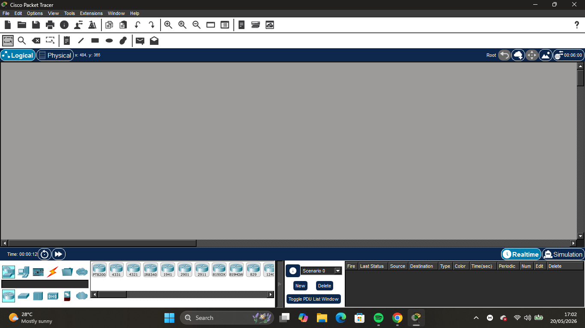
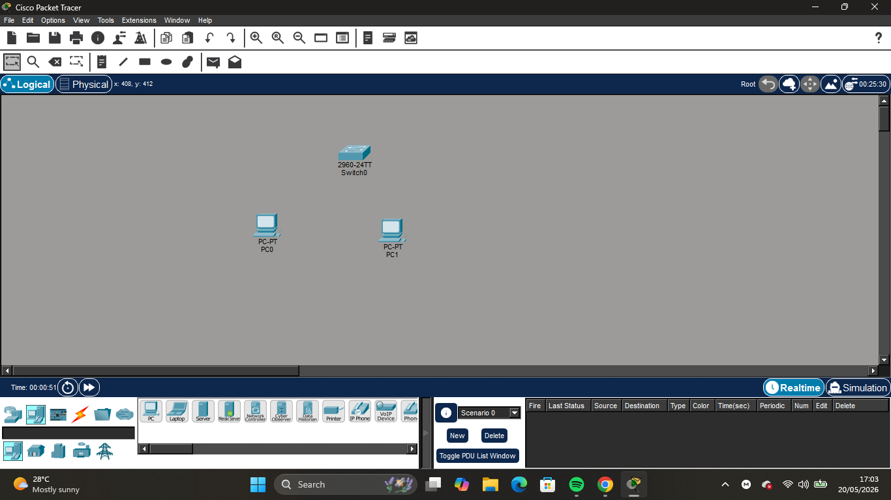
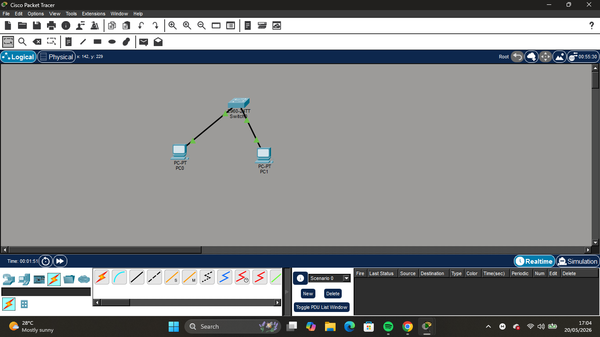
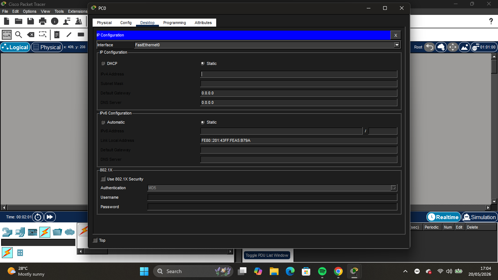
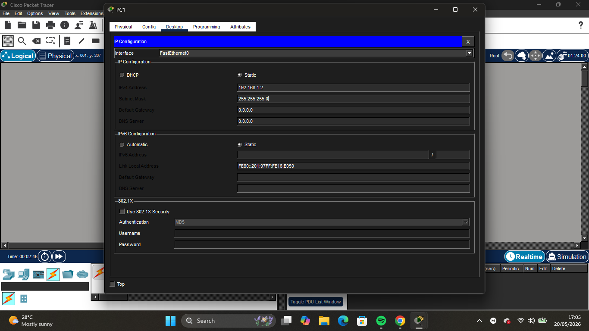
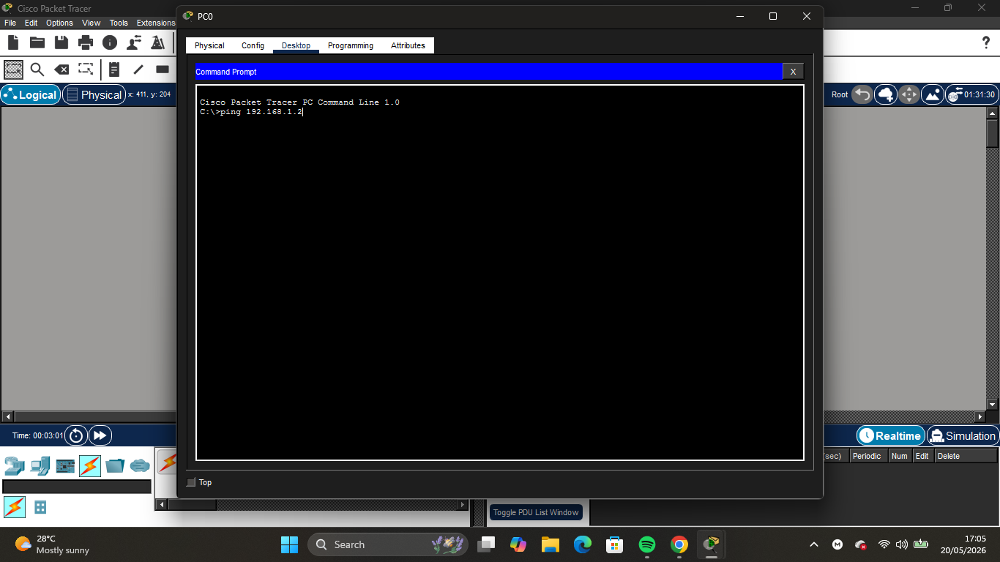
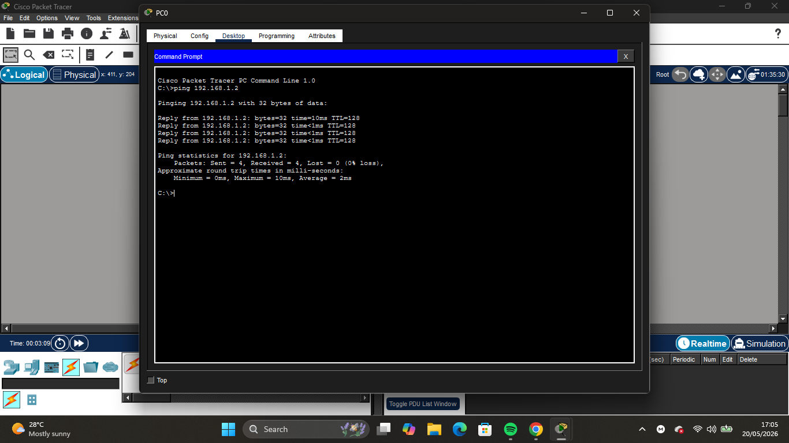

# Lab 1: Basic PC-to-PC Communication (Cisco Packet Tracer)

## 🎯 Objective
To understand how two computers communicate in a simple LAN using a switch and IP addressing.

---

## 🧱 Network Topology
PC0 → Switch → PC1

---

## ⚙️ IP Addressing

- PC0: 192.168.1.1 / 255.255.255.0  
- PC1: 192.168.1.2 / 255.255.255.0  

---

## 🛠️ Steps Performed
1. Opened Cisco Packet Tracer  
2. Added two PCs and one switch  
3. Connected devices using copper cables  
4. Configured IP addresses manually  
5. Tested connectivity using ping command  

---

## 📸 Evidence

### Network Topology

### Network Topology

### Network Topology

### Network Topology

### Network Topology

### Network Topology

### Network Topology

### Network Topology

### Ping Test

---

## ✅ Result
Successful communication between both PCs confirmed that the network is correctly configured.

---

## 🧠 Key Learning
- Basic LAN setup  
- IP addressing fundamentals  
- Device communication through a switch  
