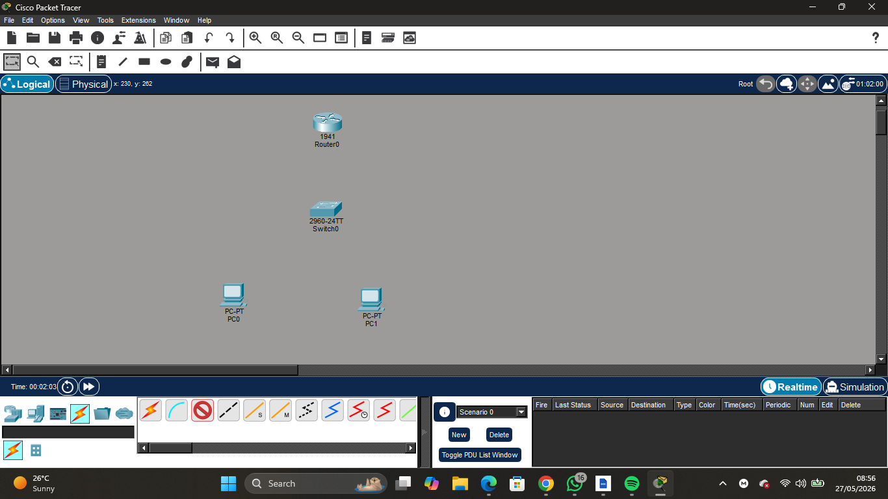
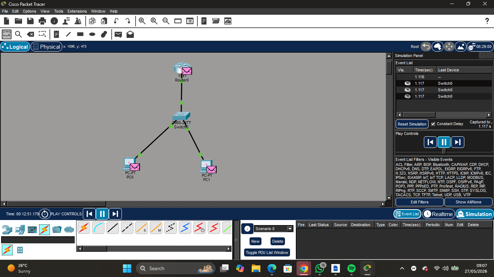
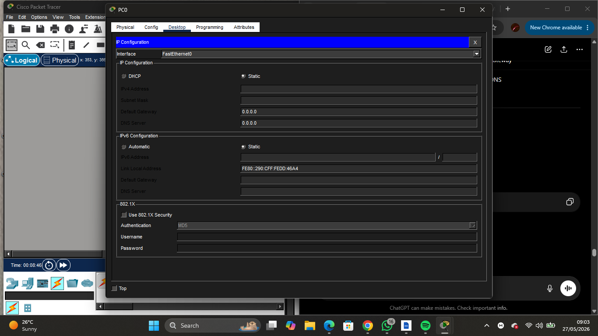
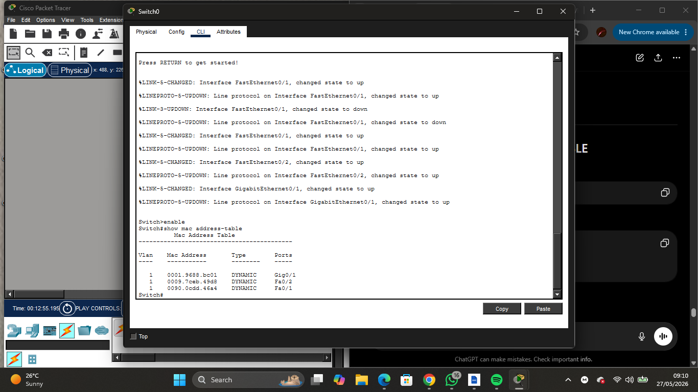
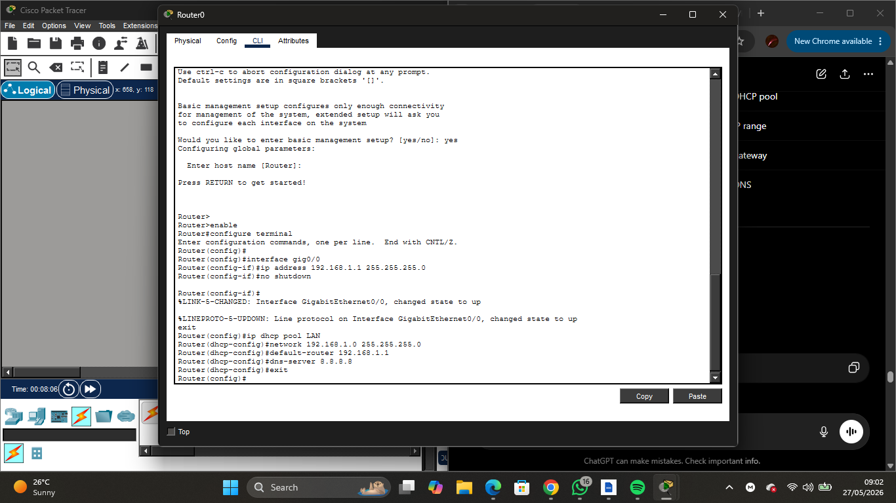
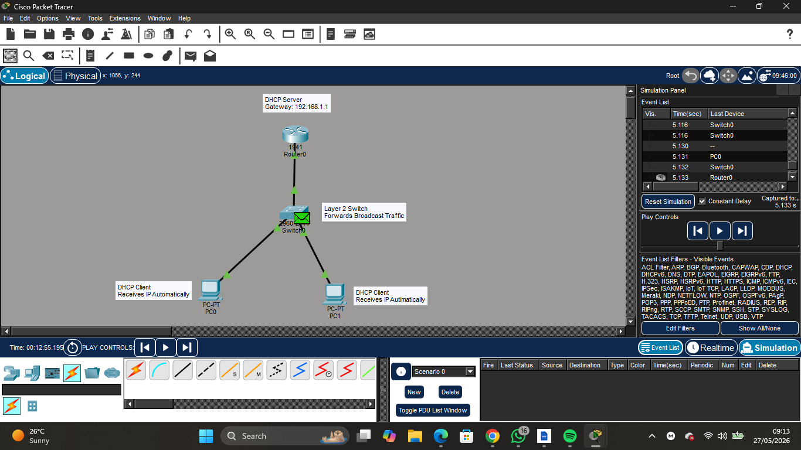

# Lab 02 — DHCP Configuration

## Objective
Configured a router as a DHCP server in Cisco Packet Tracer to automatically assign IP addresses to client PCs.

---

## Network Topology



.png)

---

## Devices Used
- 1 Router (1941)
- 1 Switch (2960)
- 2 PCs

---

## Skills Practiced
- DHCP configuration
- Router configuration
- IP assignment
- Connectivity testing
- DORA process analysis
- MAC address learning

---

## Router Configuration

```bash
enable
configure terminal

interface gig0/0
ip address 192.168.1.1 255.255.255.0
no shutdown
exit

ip dhcp pool LAN
network 192.168.1.0 255.255.255.0
default-router 192.168.1.1
dns-server 8.8.8.8
exit
```

---

## Commands Used

```bash
ipconfig
ping 192.168.1.1
show mac address-table
```

---

## DORA Process



.png)

.png)

.png)

.png)

---

## Ping Test



.png)

png)

.png)

.png)

.png)

---

## MAC Address Table



---

## Router Configuration



.png)

---

## What I Observed
- DHCP Discover packets were broadcast to all devices
- The switch forwarded DHCP traffic
- PCs automatically received IP addresses
- The DORA process was visible in simulation mode
- The switch dynamically learned MAC addresses

---

## Challenges Faced
- Initial DHCP packets failed before successful retries
- Learned the importance of enabling interfaces using `no shutdown`

---

## SOC Relevance
Understanding DHCP is important for SOC analysts because DHCP logs help identify devices, track IP assignments, and investigate suspicious network activity.

---

## Outcome
Successfully configured DHCP in Cisco Packet Tracer and verified connectivity between devices.

## Result



---
